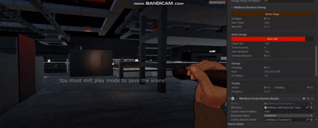
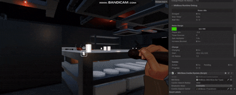
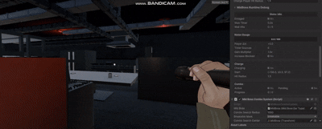
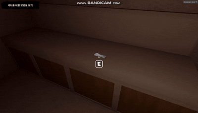
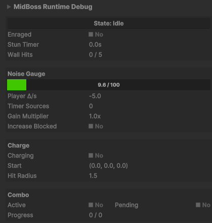
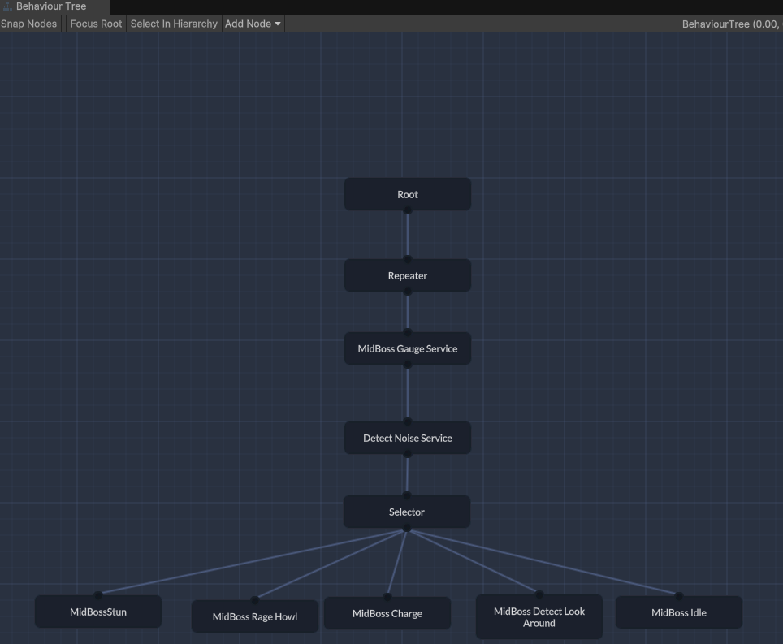
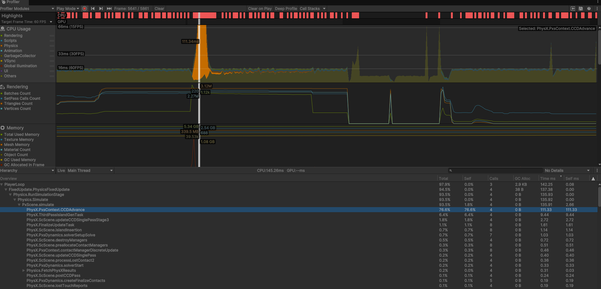

# ForJekylls — MonoBehaviourTree 기반 MidBoss AI 설계 기술 포트폴리오

---

# 목차

- [개요](#개요)
  * [소개](#소개)
    + [함께 사용된 라이브러리](#함께-사용된-라이브러리)
    + [문서 내용](#문서-내용)
- [Part 1. 구현 기능 리스트](#part-1-구현-기능-리스트)
  * [MidBoss AI 시스템](#midboss-ai-시스템)
  * [파괴 가능 환경 시스템](#파괴-가능-환경-시스템)
  * [투척 오브젝트 시스템](#투척-오브젝트-시스템)
  * [퀘스트 내비게이션](#퀘스트-내비게이션)
  * [MidBoss Runtime Inspector](#midboss-runtime-inspector)
- [Part 2. MonoBehaviourTree 소개](#part-2-monobehaviourtree-소개)
  * [MonoBehaviourTree란?](#monobehaviourtree란)
  * [MBT 핵심 요소](#mbt-핵심-요소)
  * [MidBoss BT 구조](#midboss-bt-구조)
- [Part 3. MidBoss AI 분석](#part-3-midboss-ai-분석)
  * [Service로 상태 전환 분리](#service로-상태-전환-분리)
  * [충돌 분기를 BT 밖에서 처리](#충돌-분기를-bt-밖에서-처리)
- [Part 4. 트러블슈팅](#part-4-트러블슈팅)
  * [크레이트 파편 프레임 스파이크](#크레이트-파편-프레임-스파이크)
- [프로젝트를 통해 배운 점](#프로젝트를-통해-배운-점)

---

# 개요

[](https://www.youtube.com/watch?v=6MY5yt9QY4k)

## 소개

| 항목 | 내용 |
|------|------|
| **장르** | 1인칭 호러 어드벤처 |
| **엔진** | Unity 2022 (URP) |
| **인원** | 12명 (프로그래머, 기획, 아트, 사운드) |
| **기간** | 2025.05 ~ 2026.02 (약 10개월) |
| **본인 참여** | 2025.09 ~ 2026.02 (약 6개월) |
| **버전 관리** | Git (브랜치 전략: 개인 → Dev → Main) |

프로젝트 **중반부에 합류**하여, 이미 구축된 65개 이상의 스크립트와 8개 씬으로 이루어진 코드베이스를 분석하고
그 아키텍처에 맞춰 새로운 기능을 설계·구현했습니다.

**Commit 63회 · C# 코드 +14,543줄 / -3,875줄 (Merge 제외)**

### 함께 사용된 라이브러리

1. [MonoBehaviourTree](https://github.com/Qriva/MonoBehaviourTree)
2. New Input System
3. DOTween
4. Cinemachine
5. ES3 (Save)
6. Beautify3

### 문서 내용

Part 1. 구현 기능 리스트에서는 본 프로젝트에서 구현한 기능들을 소개한다.

Part 2. MonoBehaviourTree 소개에서는 MidBoss AI의 핵심 프레임워크인 MonoBehaviourTree가 무엇이고, 어떤 요소로 구성되어 있는지 소개한다.

Part 3. MidBoss AI 분석에서는 MonoBehaviourTree를 프로젝트에 어떻게 적용했는지, 실제 코드와 함께 설계 판단을 분석한다.

Part 4. 트러블슈팅에서는 개발 과정에서 발생한 성능 문제를 Profiler 기반으로 추적하고 해결한 과정을 소개한다.

---

# Part 1. 구현 기능 리스트

## MidBoss AI 시스템


> 플레이어가 투척 오브젝트를 던지면 착지 지점에서 소음이 발생하고, NoiseDetectionGaugeManager의 게이지가 상승합니다.
> 게이지가 임계값을 넘으면 MidBoss가 소음원 방향으로 돌진하여 경로 상의 문/환경물을 파괴하고, 충돌 대상에 따라 기절 → 콤보 연속 돌진으로 분기합니다.

소음 감지 → 돌진 → 환경 파괴 → 콤보 → 기절의 전체 사이클을 MonoBehaviourTree 위에 구현했습니다.

| 구성 요소 | 설명 |
|-----------|------|
| **NoiseDetectionGaugeManager** | 플레이어 소음을 0~100 게이지로 합산하는 싱글톤 |
| **NoiseFinder** | `OverlapSphereNonAlloc()` + 고정 버퍼로 GC 없이 소음원 탐색 |
| **MidBossComboSystem** | 분노 진입 시 주변 파괴물을 순차 돌진하는 콤보 |
| **MidBossImpactFeedback** | 카메라 셰이크 + 히트스톱 + 포스트프로세싱 연출 |

## 파괴 가능 환경 시스템



MidBoss 돌진 시 경로 상의 환경물을 파괴하는 시스템입니다. `IBreakableEnvironment` 인터페이스로 파괴 가능 오브젝트를 추상화하고, 오브젝트 유형별로 파괴 방식을 다르게 구현했습니다.

| 구성 요소 | 설명 |
|-----------|------|
| **IBreakableEnvironment** | 파괴 가능 오브젝트의 공통 인터페이스. `OnHitByMidBoss()` + `IsBroken` |
| **BreakableCrate** | 즉시 파괴 → 파편 프리팹 교체 + 물리 폭발 + VFX/SFX |
| **BreakableDoor** | HP 기반 다단계 파괴. 최소 돌진 거리 미달 시 약한 연출만 재생 |
| **MeshFracture** | BFS 삼각형 클러스터링으로 메시를 실시간 파편화 |

## 투척 오브젝트 시스템

MidBoss 소음 감지와 연동되는 투척 시스템을 상속 계층 + 인터페이스 분리로 설계했습니다.

```
                    InteractableBase (기존 — E키 상호작용)
                          │
                    ThrowableBase (신규 — 줍기/던지기 공통)
                    implements: IThrowable, INoise
                          │
              ┌───────────┼───────────────┐
              │                           │
    GlassBottleThrowable         NoiseLureThrowable (신규 — 소음 유인 공통)
    (즉시 소음)                           │
                              ┌───────────┴────────────┐
                              │                        │
                    TimerLureThrowable       BrokenTimerLureThrowable
                    implements:              (고장난 타이머)
                    ITimerAdjustable
                    (조절 가능 타이머)
```

**GlassBottle** — 던지기 → 착지 시 즉시 게이지 +80



**TimerLure** — 마우스 휠로 1~10초 타이머 조절 → 던지기 → 시간 경과 후 소음 시작(+30/초)


**BrokenTimerLure** — 줍는 순간 즉시 소음 발생



## 퀘스트 내비게이션



4슬롯 Objective Indicator로 다음 목적지를 시각적으로 안내합니다.
화면 내 → World Marker, 화면 밖 → Edge Indicator로 자동 전환.
HideReason 비트 플래그(Hover/Dialogue/Cutscene)로 가시성을 관리하여, 여러 숨김 이유가 중첩되어도 정확하게 동작합니다.
Tutorial~Chapter4_1까지 전 씬에 걸쳐 퀘스트 플로우에 맞춰 마커를 설정했습니다.

## MidBoss Runtime Inspector



Unity IMGUI API(`EditorGUILayout`, `GUI.backgroundColor`, `GUILayoutUtility.GetRect`, `EditorGUI.DrawRect`)로 Custom Editor를 구현했습니다. Play 모드에서만 표시되며, `RequiresConstantRepaint()`로 매 프레임 갱신됩니다.

- **State** — 현재 BT 상태를 Blackboard에서 읽어 표시. 상태별 배경색 변경 (Idle=회색, Detect=노랑, Rage=주황, Charge=빨강, Stun=파랑)
- **Noise Gauge** — 게이지 0~100을 커스텀 프로그레스 바로 시각화. 구간별 색상 그라데이션 (0~30 초록, 30~50 노랑, 50+ 빨강)
- **Charge** — 돌진 여부, 시작 좌표, 플레이어 판정 반경
- **Combo** — Active/Pending 상태, 콤보 진행도(현재 인덱스 / 전체 타겟 수)

---

# Part 2. MonoBehaviourTree 소개

## MonoBehaviourTree란?

[MonoBehaviourTree(MBT)](https://github.com/Qriva/MonoBehaviourTree)는 Unity용 경량 Behavior Tree 프레임워크로, 프로젝트에서 이미 일반 몬스터 AI에 사용하고 있었습니다. MidBoss AI도 이 프레임워크 위에 구축했습니다.

## MBT 핵심 요소

| 요소 | 역할 |
|------|------|
| **Blackboard** | 노드 간 공유 데이터 저장소. `IntReference`, `FloatReference`, `Vector3Reference` 등 타입별 변수를 Inspector에서 바인딩 |
| **Service** | Leaf 실행과 독립적으로 매 틱 실행되는 감시자. Blackboard 값을 갱신하는 역할 |
| **Leaf** | 실제 행동을 수행하는 노드. `running`(실행 중), `success`(완료), `failure`(실패)를 반환 |
| **Selector** | 자식 노드를 좌→우 순서로 평가하여 첫 번째 `running`/`success`를 채택 (우선순위 기반) |
| **Repeater** | 자식 서브트리를 매 프레임 반복 실행 |

## MidBoss BT 구조



```
Root
 └── Repeater
       ├── MidBoss Gauge Service ─── 게이지 → Blackboard 동기화, 임계값 기반 상태 전환
       ├── Detect Noise Service ──── NoiseFinder로 소음원 탐색 → 타겟 위치 기록
       └── Selector (좌→우 우선순위)
             ├── MidBossStun ─────────── curState == Stun (최우선)
             ├── MidBoss Rage Howl ───── curState == Rage → 타겟 잠금 + 포효
             ├── MidBoss Charge ──────── curState == Charge → NavMesh 돌진
             ├── MidBoss Detect Look ─── curState == Detect → 경계 동작
             └── MidBoss Idle ────────── curState == Idle (최저 우선)
```

Repeater가 매 프레임 서브트리를 반복합니다. 두 Service가 먼저 Blackboard에 게이지와 소음원 위치를 갱신한 뒤, Selector가 좌→우 순서로 Leaf를 평가합니다. 각 Leaf는 Blackboard의 `curState`가 자신과 일치하면 `running`을 반환하여 실행을 유지하고, 불일치하면 `failure`를 반환하여 다음 Leaf로 넘어갑니다.

---

# Part 3. MidBoss AI 분석

Part 2에서 소개한 MonoBehaviourTree의 요소들을 MidBoss AI에 어떻게 적용했는지 실제 코드와 함께 분석합니다.

## Service로 상태 전환 분리

게이지 임계값(30 → Detect, 50 → Rage)에 따른 상태 전환을 Service에 배치했습니다. Leaf는 "지금 내 상태인가?"만 확인하면 됩니다.

```csharp
// MidBossGaugeService.cs — Selector보다 먼저 매 틱 실행
public override void Task()
{
    float gauge = NoiseDetectionGaugeManager.Instance.CurrentGauge;
    detectionGauge.Value = gauge;

    if (curState.Value == (int)MidBossState.Stun) return;

    if (_prevGauge < rageMin.Value && gauge >= rageMin.Value)
        curState.Value = (int)MidBossState.Rage;
    else if (_prevGauge < detectMin.Value && gauge >= detectMin.Value)
        curState.Value = (int)MidBossState.Detect;

    _prevGauge = gauge;
}
```

## 충돌 분기를 BT 밖에서 처리

돌진 후 충돌 대상(문/벽/환경물/플레이어)마다 후속 처리가 완전히 다릅니다. 이를 Leaf에 넣으면 노드가 비대해지므로, `MidBossEarType.OnChargeHit()` 한 곳에서 분기하고 BT Leaf는 Blackboard 상태 변화에 반응만 합니다.

```csharp
// MidBossEarType.cs — 충돌 대상별 분기를 한 곳에서 처리
public void OnChargeHit(Collider other, Vector3 hitPoint, Vector3 hitNormal)
{
    if (!IsCharging) return;

    if (other.gameObject.layer == LayerMask.NameToLayer("Player"))
    { HandlePlayerHit(hitPoint); return; }

    if (other.TryGetComponent(out BreakableDoor door))
    { HandleDoorHit(door, Vector3.Distance(ChargeStartPos, hitPoint)); return; }

    if (other.CompareTag(Tag_UnbreakableWall))
    { HandleUnbreakableWallHit(); return; }

    if (other.TryGetComponent(out IBreakableEnvironment breakableEnv))
    { HandleBreakableHit(breakableEnv, hitPoint, hitNormal); }
}
```

---

# Part 4. 트러블슈팅

## 크레이트 파편 프레임 스파이크

MidBoss가 크레이트를 파괴할 때 **눈에 띄는 프레임 드랍**이 발생했습니다. 이 문제를 해결하는 과정에서 3번의 가설-검증을 거쳤습니다.



---

**1단계: "Instantiate가 비쌀 것이다"**

파괴 시 파편 오브젝트 10~15개가 한 프레임에 `Instantiate()`되고 있었습니다. 런타임 오브젝트 생성이 비싸다는 판단으로, 미리 생성해두고 `SetActive(true/false)`로 전환하는 풀링 방식으로 변경했습니다.

> **결과: 개선 없음.** 프레임 스파이크가 동일하게 발생했습니다.

---

**2단계: Profiler로 실제 병목 확인**

추측이 틀렸기 때문에 Unity Profiler를 열어 실제 병목을 확인했습니다.

```
Profiler Timeline:
  PhysX.PxsContext.CCDAdvance ─── 111ms ← 여기가 병목
  Physics.Processing ─────────── 2.3ms
  Rendering ──────────────────── 4.1ms
```

실제 원인은 `Instantiate`가 아니라, 파편 Rigidbody에 설정된 **CCD(Continuous Collision Detection)** 였습니다. 파편 10~15개가 동시에 생성되면서 CCD 물리 계산이 폭증하여 한 프레임에 111ms를 소모하고 있었습니다.

파편 Rigidbody의 Collision Detection을 **Continuous → Discrete**로 변경했습니다.

> **결과: 스파이크 해결.** 하지만 파편이 바닥을 뚫고 떨어지기 시작했습니다.

---

**3단계: 파편이 바닥을 통과하는 문제**

Discrete로 변경하면서 파편끼리의 불필요한 충돌을 줄이기 위해 Debris 전용 레이어를 만들었는데, 이 레이어와 바닥(Default) 레이어 간 충돌이 Physics 충돌 매트릭스에서 꺼져 있었습니다.

충돌 매트릭스를 **Debris↔Debris만 OFF**, 나머지는 ON으로 조정하여 해결했습니다.

> **최종 결과: 프레임 스파이크 해결 + 파편 정상 동작.**

---

> **이 과정에서 배운 것:** 성능 문제를 마주했을 때, "아마 이게 원인일 것이다"라는 추측으로 바로 최적화에 들어가면 실제 병목을 놓칩니다. Profiler로 수치를 확인한 후에야 진짜 원인(CCD)을 특정할 수 있었습니다.

---

# 프로젝트를 통해 배운 점

## 기존 코드베이스 합류 경험
- 65개 이상의 스크립트, 8개 씬으로 구성된 프로젝트에 **문서 없이** 중반부 합류
- 코드만으로 아키텍처를 파악하고, **기존 패턴(MonoBehaviourTree, Blackboard, LayerMask, ScenarioManager)을 준수**하며 기능 확장

## 문제 해결 능력
- Unity 물리 엔진의 **NavMeshAgent-Trigger 상호작용 한계**를 파악하고 이중 감지 전략으로 해결
- MBT Service-Leaf 간 **레이스 컨디션**을 발견하고 타겟 잠금 패턴으로 해결
- 성능 문제를 **Profiler 기반**으로 추적하여 실제 병목(CCD)을 특정
- Blackboard 기반 상태 관리에서 **스테일 데이터 생명주기** 관리

## 설계 역량
- MidBoss AI의 전체 사이클(게이지 → 상태 전환 → 돌진 → 충돌 분기 → 콤보)을 MonoBehaviourTree 아키텍처 위에 설계
- 투척 시스템의 **상속 계층과 인터페이스 분리**(ISP)를 통한 확장 가능한 구조 설계 및 리팩토링(-56%)
- **INoise 인터페이스**를 통한 소음 감지 ↔ 투척 시스템의 느슨한 결합
- MidBoss 디버깅을 위한 **Custom Editor Inspector**를 IMGUI API로 직접 구현

## 실무 협업
- 12명 팀에서 Git 브랜치 전략을 통한 협업
- 기획/아트 요구사항에 맞춰 **Inspector 조절 가능한 파라미터** 설계
